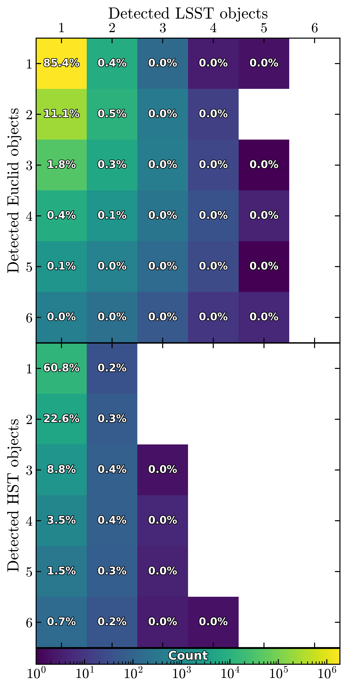
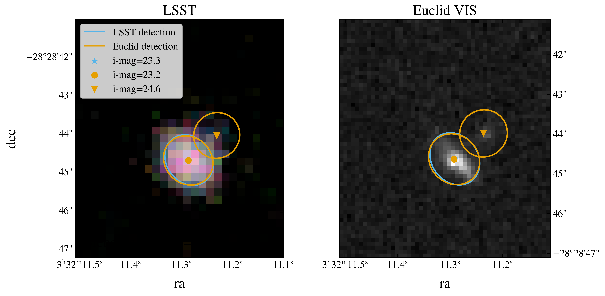

# Unrecognized blends in LSST DP1 and DP2 from the comparison with Euclid and HST

```{abstract}
We estimate the fraction of unrecognized blends in DP1 and DP2 data from the comparison with Euclid and HST in ECDFS
<!-- Unrecognized blends, where the number of detected objects is smaller than the number of true sources, are a known issue in LSST data and a significant source of photometric error. In this technote, we present our methodology for identifying unrecognized blends in the LSST Data Preview 1 and Data Preview 2 (hereafter DP1 and DP2, respectively) datasets by comparing them with high-resolution observations from the Euclid Q1 and Hubble Space Telescope (HST) in the Extended Chandra Deep Field South (ECDFS). By matching sources detected in the LSST data with those from the space telescopes, we quantify the fraction of sources that are blended in LSST but resolved in the space-based data. We find that up to 22% of sources in both DP1 and DP2 are unrecognized blends when compared to Euclid Q1 data at 23 < i-band magnitude < 24. When compared to HST data, the fraction of unrecognized blends reaches up to 40% for the same magnitude range. We finally use the blending entropy to quantify, for each of those unrecognized blends in the LSST data, how ambiguous its galaxy association is. -->
```

## Data
<!-- ECDFS | LSST DP1 and DP2 (what changes between the two) | Euclid Q1 | HST -->
The Extended Chandra Deep Field South (ECDFS) is a deep-sky survey field that has been observed by multiples telescopes at different wavelengths due to its low galactic obscuration {cite}`Lehmer05`. The LSST Data Preview 1 (DP1) {cite}`RTN-095` and Data Preview 2 (DP2) {cite}`RTN-115` both cover the ECDFS field.

`LSSTCam/runs/DRP/DP2/v30_0_8/DM-55060/stage3`

```{figure} ./assets/plots/ecdfs.png
:alt: ECDFS

One tenth of the detected galaxies in the ECDFS observed by LSST, Euclid and HST.
```

In the following sections, we will refer as `objects` the sources detected in the LSST DP datasets and as `galaxies` the sources detected in the Euclid and HST datasets. We will also refer to `blends` as the objects that are associated with more than one galaxy.

## Methods

### Matching LSST DP catalogs with Euclid and HST

We match the sources detected in the LSST DP datasets with those from Euclid and HST. For each galaxy detected

1. Friends-Of-Friends catalog matching {cite}`FoFMatching`
2. Ellipse Overlap Test:
After making this matching in two steps, we can compute the number of objects per group.


### Blending entropy

For each object detected in the LSST DP, we can assign it a blendy entropy score {cite}`Ramel26` which quantifies how ambiguous its galaxy association is. The blending entropy for a given wavelength band is defined as:

```{math}
S_\text{b} = -\sum_{\text{g}\in\text{gal}} p_\text{og} \ln(p_\text{og}) \quad \text{with} \quad p_\text{og} \propto \left\langle \text{o},\text{g} \right\rangle \exp\left(-\left|  m_\text{o}-m_\text{g}\right|\right)
```

$p_\text{og}$ is the matching probability of object `o` with a galaxy `g`. It is the intersection-over-union of the two ellipses: the area they share divided by the area they cover together from 0 (disjoint) to 1 (identical). It is also normalized per object so that $\sum_{\text{g}\in\text{gal}}p_\text{og} = 1$. Systems with one object and one galaxy have a matching probability of 1 and a blending entropy of 0. The blending entropy ranges from 0, meaning no ambiguity, to log(N), meaning maximum ambiguity with N being the number of galaxies in the group.



However, the blending entropy needs to computed for the same wavelength band. Since the LSST DP datasets have been obserbed in the `ugrizy` bands, we compute the blending entropy using the relevant amount of bands that are the closest to the Euclid VIS band and the HST F814W band and making a fit to be able to compare them. We chose to construct a fit on the following bands `riz` and `VIS` for the LSST-Euclid comparison and `i` and `F814W` for the LSST-HST comparison. The fit will be computed using solely the 1-1 systems and then applied to every object in the LSST DP datasets.

## Results

<!-- ![[./assets/dp2_unrec_frac_and_mag.pdf]] -->


## References

```{bibliography}
```

See the [Documenteer documentation](https://documenteer.lsst.io/technotes/index.html) for tips on how to write and configure your new technote.
