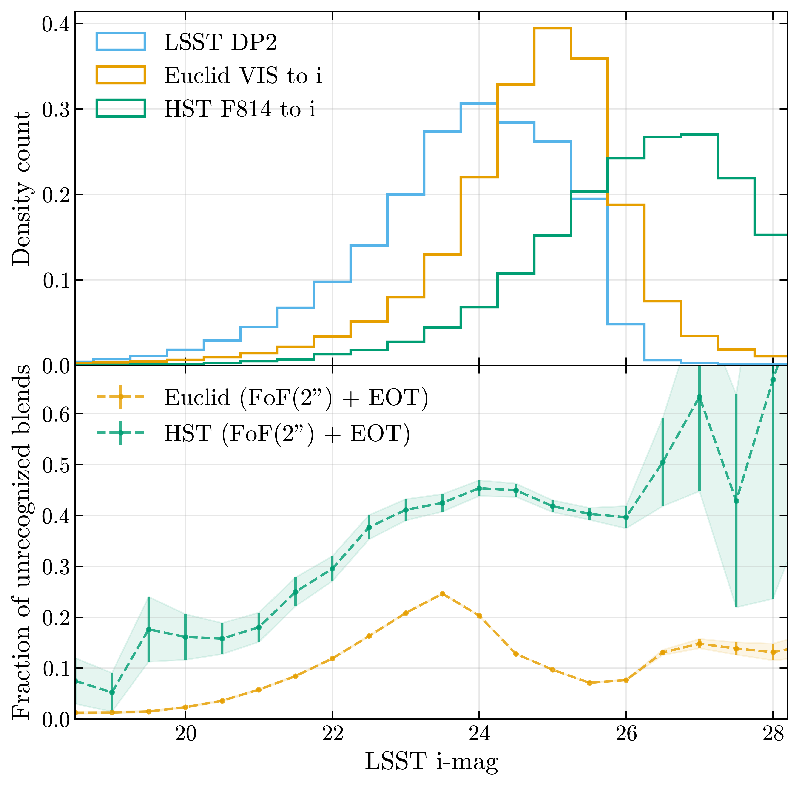

# Unrecognized blends in LSST DP1 and DP2 from the comparison with Euclid and HST

```{abstract}
Unrecognized blends, where the number of detected objects is smaller than the number of true sources, are a known issue in LSST data and a significant source of photometric error. In this technote, we present our methodology for identifying unrecognized blends in the LSST Data Preview 1 and Data Preview 2 (hereafter DP1 and DP2, respectively) datasets by comparing them with high-resolution space-based observations from the Euclid Q1 and Hubble Space Telescope (HST) in the Extended Chandra Deep Field South (ECDFS). By matching sources detected in the LSST data with those from the space telescopes, we quantify the fraction of sources that are blended in LSST but resolved in the space-based data. We find that up to 22% of sources in both DP1 and DP2 are unrecognized blends when compared to Euclid Q1 data at 23 < i-band magnitude < 24. When compared to HST data, the fraction of unrecognized blends reaches up to 40% for the same magnitude range. We finally use the blending entropy to quantify, for each of those unrecognized blends in the LSST data, how ambiguous its galaxy association is.
```

## Data
<!-- ECDFS | LSST DP1 and DP2 (what changes between the two) | Euclid Q1 | HST -->
The Extended Chandra Deep Field South (ECDFS) is a deep-sky survey field that has been observed by multiples telescopes at different wavelengths due to its low galactic obscuration {cite}`Lehmer05`. The LSST Data Preview 1 (DP1) {cite}`RTN-095` and Data Preview 2 (DP2) {cite}`RTN-115` both cover the ECDFS field.

The LSST DP datasets both have a pixel scale of 0.2 arcsec/pixel while the Euclid Q1 data has a pixel scale of 0.1 arcsec/pixel and HST has a pixel scale of 0.05 arcsec/pixel.

```python
repo='dp2_prep'
collection = 'LSSTCam/runs/DRP/DP2/v30_0_8/DM-55060/stage3'
skymap = 'lsst_cells_v2'
butler_cat = 'object'
```
<!-- `LSSTCam/runs/DRP/DP2/v30_0_8/DM-55060/stage3` -->

<!-- For LSST DP, point-like sources are removed with `i_extendedness == 1`. -->

```{figure} ./assets/plots/ecdfs_two_panel_vertical.png
:name: fig-ecdfs
:alt: ECDFS
:width: 100%

Top: One tenth of the detected galaxies in the ECDFS observed by LSST. The blue region corresponds to our region of study we chose this region to not have the single visits effects (lower magnitude detections and artifacts). The grey region is discarded due to the presence of single visits. The circle discrimnating the two regions has a radius on the sky of  2.1 degrees and centered around the coordinates RA=53.05, Dec=-28.15 degrees.
Bottom: One tenth of the detected galaxies in the ECDFS observed by LSST, Euclid and HST.
```

<!-- | | LSST DP2 | Euclid | HST |
| --- | --- | --- | --- |
| Number of total sources | 3,610,708 | 5,328,489 | 165,776 |
| LSST DP2 data inside footprint | n/a | 2,416,305 | 33,240 |
| Area $\left\lbrack\mathrm{deg}^2\right\rbrack$ | 43.35 | 15.53 | 0.18 | -->

The Euclid footprint has an area of ~$15.53 \, \mathrm{deg}^2$ and contains a total of 5,328,489 galaxies detected in the VIS band and, in that same footprint there are 2,416,305 objects detected in the LSST DP2 dataset.\
In the HST footprint of area ~$0.18 \, \mathrm{deg}^2$ there is a total of 165,776 galaxies detected in the F814W band and, in that same footprint there are 33,240 objects detected in the LSST DP2 dataset.

In the following sections, we will refer as `objects` the sources detected in the LSST DP datasets and as `galaxies` the sources detected in the Euclid and HST datasets. We will also refer to `blends` as the objects that are associated with more than one galaxy. Moreover, the plots shown, unless stated otherwise, are for the LSST DP2 dataset. The results for the LSST DP1 dataset are similar and can be found in the Appendix of this technote.

## Methods

### Matching LSST DP catalogs with Euclid and HST

We match the sources detected in the LSST DP datasets with those from Euclid and HST using a two-step process:

1. Friends-Of-Friends (FoF) catalog matching {cite}`FoFMatching`: Iteratively and transitively connecting "friends" pairs within a specified linking length and merging their associated groups. It starts with each object as its own group, then recursively merges groups if any member of one group is within the linking length of any member of another. The choice of linking length defines the scale of the resulting structures. We chose a linking length of 2 arcsec to make coarse groups.
2. Ellipse Overlap Test (EOT): For each element (object/galaxy) in each group, we check if the ellipses (computed from the semi-major and semi-minor axes and the position angle of the detection) of the elements overlap with the ellipses of the other elements. If they do, we consider them as matched and keep them as a group. If there is no overlap, we split the group into two subgroups and repeat the process until all elements in each group have overlapping ellipses.

Adding the EOT step after the FoF matching makes our matching independant from the linking length choice. The result of this matching is a set of groups where each groups contains one or more objects and one or more galaxies. If multiple elements are in the group, then they are overlapping, at least transitively.
<!-- <span style="color: red;"> each other transitively (badly worded?)</span>. -->
After making this matching, we can compute the number of objects and galaxies per group, as shown in {numref}`fig-nm-groups`.

```{figure} ./assets/plots/detect_counts_cbar_on_bottom_vertical.png
:name: fig-nm-groups
:alt: N-M groups
:width: 80%

Result of the cross-matching of catalogs LSST-Euclid and LSST-HST using FoF+EOT matching method. Each bin in the 2D histogram represents a group for a given number of objects, meaning LSST detections in columns and galaxies, meaning Euclid detections (top) or HST detections (bottom) in rows. The colorbar indicates the number count of groups in each bin.
```

We call unrecognized blends the groups having more galaxies than objects which corresponds to the lower left part of {numref}`fig-nm-groups`. The fraction of unrecognized blends is higher for HST is higher than Euclid due to the higher resolution and depth of the HST data. Using this plot, we estimate that 13.8% of LSST DP2 objects are unrecognized blends when compared to Euclid and 38.7% when compared to HST.

### Blending entropy

For each object detected in the LSST DP, we can assign it a blendy entropy score {cite}`Ramel26` which quantifies how ambiguous its galaxy association is. The blending entropy for a given wavelength band is defined as:

```{math}
S_\text{b} = -\sum_{\text{g}\in\text{gal}} p_\text{og} \ln(p_\text{og}) \quad \text{with} \quad p_\text{og} \propto \left\langle \text{o},\text{g} \right\rangle \exp\left(-\left|  m_\text{o}-m_\text{g}\right|\right)
```

$p_\text{og}$ is the matching probability of object `o` with a galaxy `g`. It is the intersection-over-union of the two ellipses: the area they share divided by the area they cover together from 0 (disjoint) to 1 (identical). It is also normalized per object so that $\sum_{\text{g}\in\text{gal}}p_\text{og} = 1$. Systems with one object and one galaxy have a matching probability of 1 and a blending entropy of 0. The blending entropy ranges from 0, meaning no ambiguity, to log(N), meaning maximum ambiguity with N being the number of galaxies in the group.

```{figure} ./assets/low_blending_entropy.png
:alt: Low Sb

Low $S_\text{b}$ blend.
```

<!-- **those are dp1 image, make dp2 images** -->

However, the blending entropy needs to computed for the same wavelength band. Since the LSST DP datasets have been obserbed in the `ugrizy` bands, we compute the blending entropy using the relevant amount of bands that are the closest to the Euclid VIS band and the HST F814W band and making a fit to be able to compare them. We chose to construct a fit on the following bands `riz` and `VIS` for the LSST-Euclid comparison and `i` and `F814W` for the LSST-HST comparison. The fit will be computed using solely the 1-1 systems and then applied to every object in the LSST DP datasets.

## Results

<!-- ![[./assets/dp2_unrec_frac_and_mag.pdf]] -->



## References

```{bibliography}
```

See the [Documenteer documentation](https://documenteer.lsst.io/technotes/index.html) for tips on how to write and configure your new technote.
